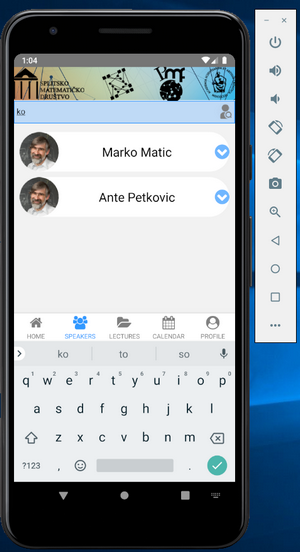
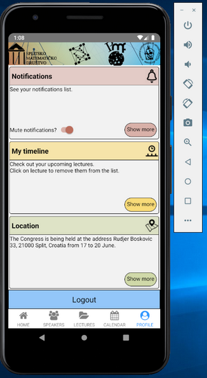

Implementation of React Native congress mobile app for Android/iOS.

\*NOT FINISHED

MAIN FEATURES

Registration/login user, searchable list of speakers and lectures, review congress calendar, user timeline of saved lectures, push notifications.

cd android => ./gradlew bundleRelease/assembleRelease (generating aab/apk)

APPLICATION SCREENS

1st => landing animation screen

2nd => login and registration screen
 

3rd => home tab screen
 

4th => speakers and lectures tab screen
 

5th => calendar screen

6th => profile and timeline screen
 
